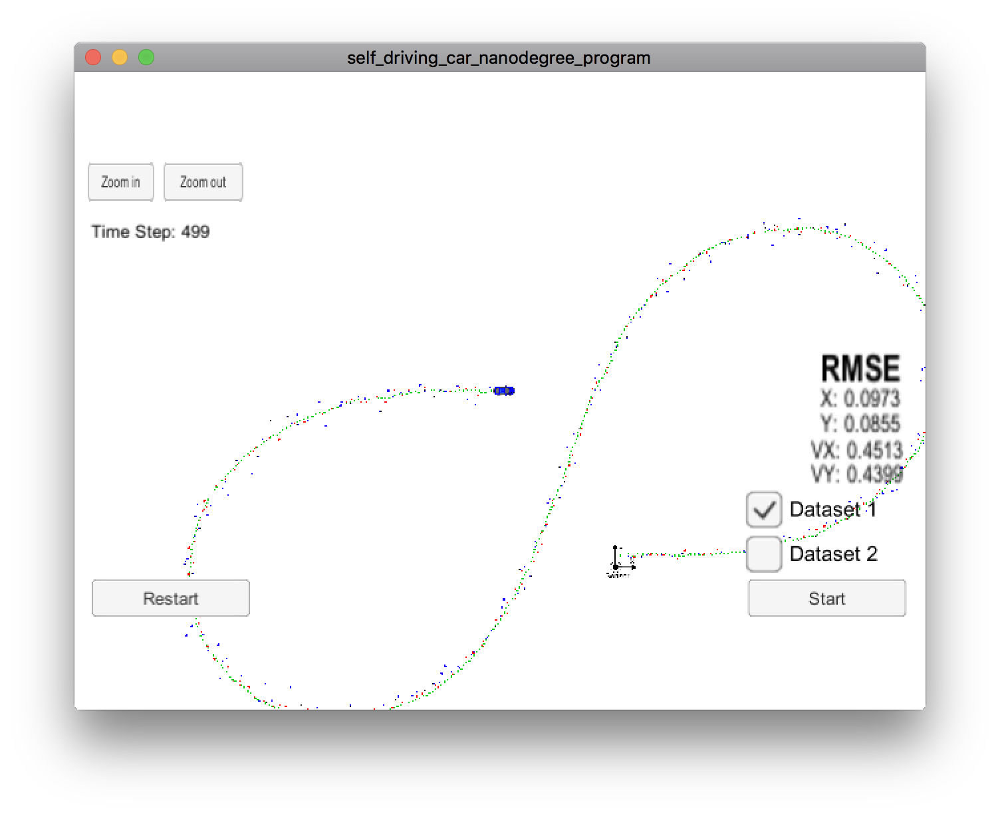
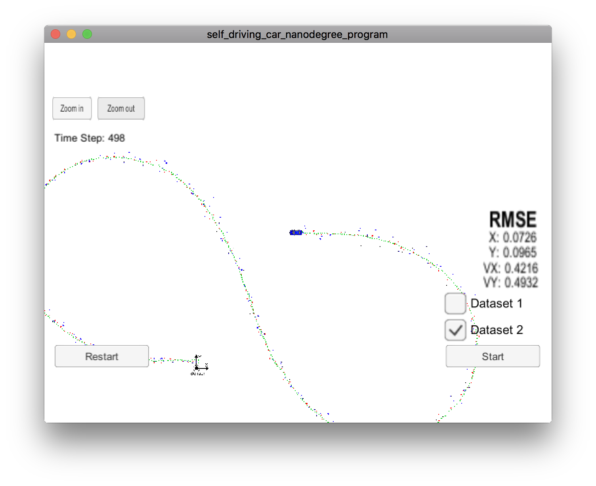

# **Extended Kalman Filter**

March 7, 2020 - John Robinson

**Extended Kalman Filter Project**

**Project 5** in Udacity’s Self-Driving Car Nanodegree

Project rubrik: https://review.udacity.com/#!/rubrics/748/view

---

My Project Repository: https://github.com/johnrobinsn/CarND-Extended-Kalman-Filter-Project.git

Self-Driving Car Engineer Nanodegree Program

In this project I was able to utilize a kalman filter to estimate the state of a moving object of interest with noisy lidar and radar measurements. Passing the project requires obtaining RMSE values that are lower than the tolerance outlined in the project rubric. 

This project involves the Term 2 Simulator which can be downloaded [here](https://github.com/udacity/self-driving-car-sim/releases).

This repository includes two files that can be used to set up and install [uWebSocketIO](https://github.com/uWebSockets/uWebSockets) for either Linux or Mac systems. For windows you can use either Docker, VMware, or even [Windows 10 Bash on Ubuntu](https://www.howtogeek.com/249966/how-to-install-and-use-the-linux-bash-shell-on-windows-10/) to install uWebSocketIO. Please see the uWebSocketIO Starter Guide page in the classroom within the EKF Project lesson for the required version and installation scripts.

Once the install for uWebSocketIO is complete, the main program can be built and run by doing the following from the project top directory.

1. mkdir build
2. cd build
3. cmake ..
4. make
5. ./ExtendedKF

Tips for setting up your environment can be found in the classroom lesson for this project.

Note that the programs that need to be written to accomplish the project are src/FusionEKF.cpp, src/FusionEKF.h, kalman_filter.cpp, kalman_filter.h, tools.cpp, and tools.h

The program main.cpp has already been filled out, but feel free to modify it.

Here is the main protocol that main.cpp uses for uWebSocketIO in communicating with the simulator.

**INPUT**: values provided by the simulator to the c++ program

["sensor_measurement"] => the measurement that the simulator observed (either lidar or radar)

**OUTPUT**: values provided by the c++ program to the simulator

["estimate_x"] <= kalman filter estimated position x

["estimate_y"] <= kalman filter estimated position y

["rmse_x"]

["rmse_y"]

["rmse_vx"]

["rmse_vy"]

---

## Other Important Dependencies

* cmake >= 3.5
  * All OSes: [click here for installation instructions](https://cmake.org/install/)
* make >= 4.1 (Linux, Mac), 3.81 (Windows)
  * Linux: make is installed by default on most Linux distros
  * Mac: [install Xcode command line tools to get make](https://developer.apple.com/xcode/features/)
  * Windows: [Click here for installation instructions](http://gnuwin32.sourceforge.net/packages/make.htm)
* gcc/g++ >= 5.4
  * Linux: gcc / g++ is installed by default on most Linux distros
  * Mac: same deal as make - [install Xcode command line tools](https://developer.apple.com/xcode/features/)
  * Windows: recommend using [MinGW](http://www.mingw.org/)

## Basic Build Instructions

1. Clone this repo.
2. Make a build directory: `mkdir build && cd build`
3. Compile: `cmake .. && make` 
   * On windows, you may need to run: `cmake .. -G "Unix Makefiles" && make`
4. Run it: `./ExtendedKF `

## Approach and Outcome

After integrating the code done in earlier excercises, I was left with focusing on a few minor system initialization gaps and to setup the UpdateEKF, function.  The UpdateEKF function performs the upate step for a Kalman filter where we have a non-linear measurement function, which we have given the radar sensor measurements.  After getting these set up I was able to run the simulator and meet the performance criteria for the project, with an RMSE of less than [.11, .11, 0.52, 0.52].

## Dataset 1

Here is a screenshot of the simulator using the first dataset:

I was able get an RMSE of [0.0973,0.0855,0.4513,0.4399] on Dataset 1.

## Dataset 2

Here is a screenshot of the simulator using the second dataset:

I was able to get an RMSE of [0.0726,0.0965,0.4216,0.4932] on Dataset 2.

